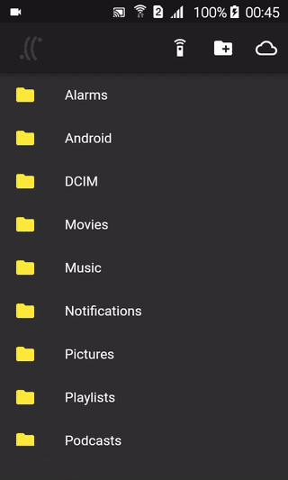

A mobile file explorer with peer to peer file transfer and remote file server connection. Note: as mobile networks usually prevent devices to act as servers the peer to peer file transfer will generaly just work when the devices are on the same wifi network.

## Install

Download [airlink.apk](https://github.com/synw/airlink/releases/download/0.1.0/airlink.apk) for Android or compile the source with Flutter.

Download [airlink_server](https://github.com/synw/airlink/releases/download/0.2.0/airlink_server) for Linux or compile with Go. The server is not needed for peer to peer file transfer.

## Server mode

### Device

A device can be configured as a server: in the app select the root directory and start the server. The connected remote devices will be able to download from this directory. A flashable qr code will be available for other devices to auto config this datalink.

### Fileserver

Place a `config.json` file next to the binary:

   ```json
   {
      "port": "8084",
      "apiKey": "API_KEY"
   }
   ```

To serve data create a `static` folder next to the server binary: this is the root folder for the data to be served

To generate a qr code in the terminal for devices autoconfig:

   ```bash
   ./airlink -c
   ```

To generate a qr code image for devices autoconfig:

   ```bash
   ./airlink -ci
   ```